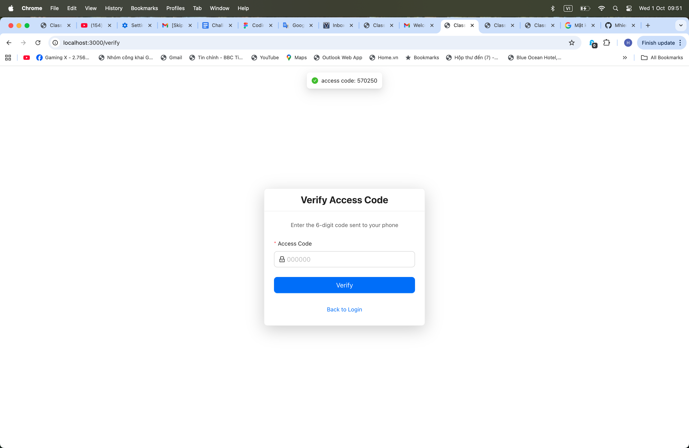

# Ứng dụng Quản lý Lớp học

Hệ thống quản lý lớp học full-stack với React, Express, Firebase và Socket.io.

## Công nghệ sử dụng

Frontend: React, Ant Design, Axios, Socket.io Client
Backend: Node.js, Express, Firebase Admin SDK, Socket.io, Twilio, Nodemailer


## Hướng dẫn cài đặt

### 1. Clone Repository

```bash
git clone <repository-url>
cd SKIPLI
```

### 2. Cài đặt Backend

```bash
cd backend
npm install
```

Tạo file `.env` trong thư mục backend:

```env
PORT=3001

INSTRUCTOR_PHONE=+1234567890

TWILIO_ACCOUNT_SID=your_twilio_account_sid
TWILIO_AUTH_TOKEN=your_twilio_auth_token
TWILIO_PHONE_NUMBER=your_twilio_phone_number

EMAIL_USER=your_email@gmail.com
EMAIL_PASS=your_app_password

FIREBASE_PROJECT_ID=your_firebase_project_id
FIREBASE_PRIVATE_KEY="your_firebase_private_key"
FIREBASE_CLIENT_EMAIL=your_firebase_client_email

NODE_ENV=development
SMS_PROVIDER=dev

FRONTEND_URL=http://localhost:3000
```

### 3. Cài đặt Frontend

```bash
cd ../frontend
npm install
```

Tạo file `.env` trong thư mục frontend:

```env
REACT_APP_API_URL=http://localhost:3001/api
REACT_APP_SOCKET_URL=http://localhost:3001
```

### 4. Cấu hình Firebase

1. Truy cập Firebase Console (https://console.firebase.google.com)
2. Tạo project mới
3. Bật Firestore Database
4. Vào Project Settings - Service Accounts
5. Tạo private key mới
6. Copy thông tin vào file .env của backend

### 5. Cấu hình Twilio (Tùy chọn)


## Chạy ứng dụng

### Chạy Backend

```bash
cd backend
npm start
```

Backend chạy tại http://localhost:3001

### Chạy Frontend

```bash
cd frontend
npm start
```

Frontend chạy tại http://localhost:3000

## Lưu ý quan trọng

### Đăng nhập
- SMS Login: Chỉ số điện thoại được cấu hình trong INSTRUCTOR_PHONE mới có thể đăng nhập với role Instructor
- Email Login: Dành cho Student (phải được Instructor thêm vào trước)
- Twilio chưa được triển khai hoàn toàn, hiện tại đang dùng dev mode (code hiển thị trên màn hình)

## Biến môi trường

### Backend .env
- PORT: Cổng server (mặc định: 3001)
- INSTRUCTOR_PHONE: Số điện thoại duy nhất có quyền đăng nhập làm Instructor
- TWILIO_ACCOUNT_SID, TWILIO_AUTH_TOKEN, TWILIO_PHONE_NUMBER: Thông tin Twilio (chưa triển khai)
- EMAIL_USER, EMAIL_PASS: Thông tin Gmail để gửi email
- FIREBASE_PROJECT_ID, FIREBASE_PRIVATE_KEY, FIREBASE_CLIENT_EMAIL: Thông tin Firebase
- NODE_ENV: development hoặc production
- SMS_PROVIDER: dev (chế độ hiện tại)
- FRONTEND_URL: URL frontend cho CORS

### Frontend .env
- REACT_APP_API_URL: URL API backend
- REACT_APP_SOCKET_URL: URL server Socket.io

## Screenshots

### Login & Access Code



### Instructor Dashboard


### Student Dashboard


